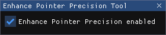

# Enhance Pointer Precision Tool

A simple, self-contained Windows tool to display and toggle "Enhanced Pointer Precision" a.k.a. mouse acceleration.

## About

This little tool was birthed during an FPS gaming session where we tested different mouse settings and quickly realized that a lot of mouse configuration software (like iCUE from CORSAIR) likes to silently turn mouse acceleration on which distorts the aim feel in games like Quake Champions. This option is buried somewhere deep within Windows' nonsensical UI so I made this tool for it. It's deliberately kept minimal; just a modal window with a checkbox that represents the current state and lets you toggle it.

## Screenshots

## 3rd party credits

- [Dear ImGui](https://github.com/ocornut/imgui)
- [Simple and Fast Multimedia Library](https://www.sfml-dev.org/)
- [ImGui-SFML](https://github.com/SFML/imgui-sfml)
